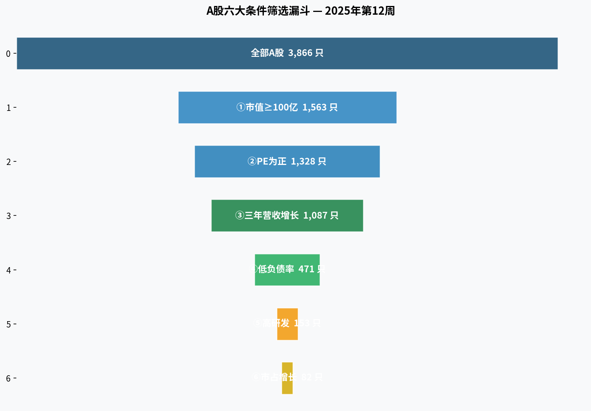
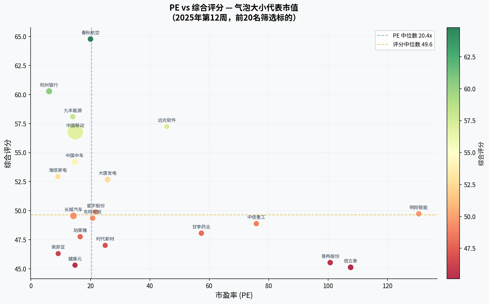
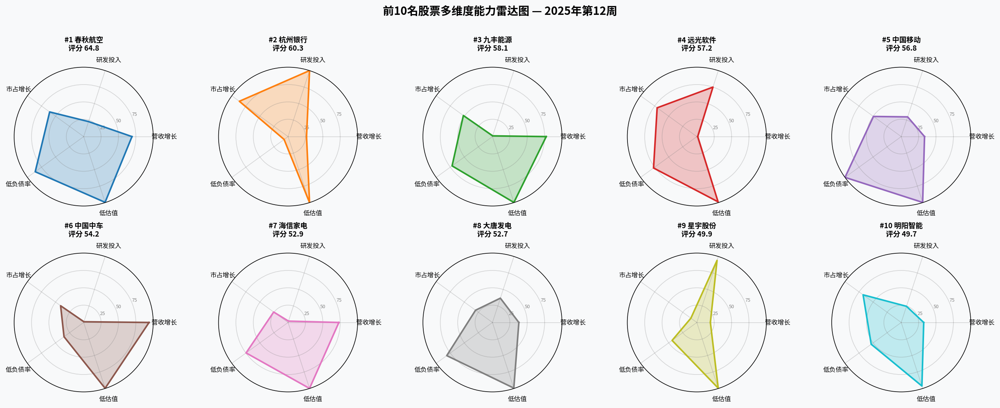
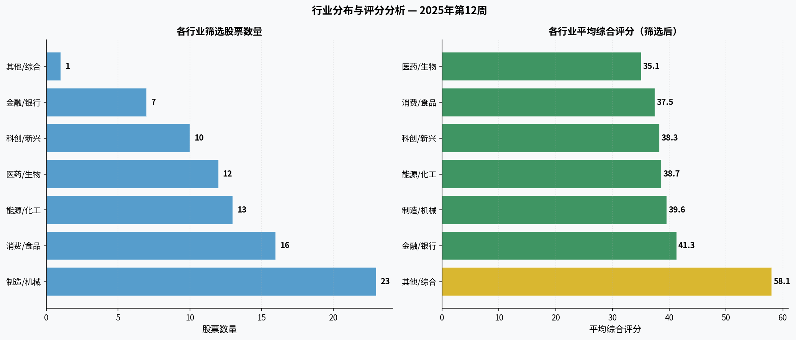

# A股优质投资标的筛选报告 — 2025年第12周

> **报告日期：** 2025年3月21日  
> **数据截止：** 2025年3月21日  
> **分析师：** Manus AI  
> **分析范围：** 沪深两市 A 股（上证 + 深证）

---

## 一、执行摘要

本报告基于六大核心财务与市场指标，对沪深两市 **3,866 只** A 股进行系统性筛选，最终遴选出 **82 只** 符合全部条件的优质投资标的，并从中推荐 **前10名** 作为重点关注对象。

### 核心推荐（前5名）

| 排名 | 股票名称 | 代码 | 综合评分 | 市值（亿） | PE | 三年营收增长 |
|:---:|:---:|:---:|:---:|:---:|:---:|:---:|
| 1 | **春秋航空** | 601021 | 64.8 | 456 | 20.0x | +63.2% |
| 2 | **杭州银行** | 600926 | 60.3 | 1212 | 6.1x | +24.2% |
| 3 | **九丰能源** | 605090 | 58.1 | 269 | 14.1x | +70.3% |
| 4 | **远光软件** | 002063 | 57.2 | 134 | 45.7x | +1.2% |
| 5 | **中国移动** | 600941 | 56.8 | 20842 | 14.9x | +30.5% |

---

## 二、筛选方法论

### 2.1 六大筛选条件

| # | 筛选条件 | 说明 | 筛选后数量 |
|:---:|:---|:---|:---:|
| ① | **市值规模** | 总市值 ≥ 100 亿人民币 | 1,563 只 |
| ② | **盈利能力** | 市盈率（PE）> 0（排除亏损股） | 1,328 只 |
| ③ | **成长性** | 过去三年营业收入总体增长（增速 > 0） | 1,087 只 |
| ④ | **财务稳健** | 资产负债率低于行业平均水平 10% 以上 | 471 只 |
| ⑤ | **创新投入** | 研发费用率高于行业平均水平 10% 以上 | 153 只 |
| ⑥ | **竞争力** | 市场占有率呈增长趋势 | 82 只 |

### 2.2 综合评分权重

| 维度 | 权重 | 说明 |
|:---|:---:|:---|
| 三年营收增长率 | 28% | 成长性是核心驱动力 |
| 研发费用行业相对值 | 22% | 创新能力决定长期竞争力 |
| 市场份额增长 | 18% | 竞争地位的直接体现 |
| 资产负债率行业相对值 | 18% | 财务安全边际 |
| 市盈率（越低越好） | 14% | 估值合理性 |

---

## 三、筛选漏斗

*图1：六大条件逐步筛选漏斗，从全市场逐层收窄至最终标的*

---

## 四、核心分析图表

### 4.1 PE vs 综合评分（前20名）

*图2：气泡大小代表市值规模；颜色越绿评分越高；理想标的位于左上角（低PE + 高评分）*

### 4.2 前10名多维度雷达图

*图3：五维度能力雷达图，面积越大表示综合能力越强*

### 4.3 行业分布与评分

*图4：左侧为各行业筛选股票数量，右侧为各行业平均综合评分*

---

## 五、前10名重点推荐

### 🥇 第1名：春秋航空（601021）

| 指标 | 数值 |
|:---|:---|
| 综合评分 | **64.8 / 100** |
| 当前价格 | 46.65 元 |
| 总市值 | 456 亿元 |
| 市盈率（PE） | 20.0 倍 |
| 市净率（PB） | 2.51 倍 |
| 三年营收增长率 | +63.2% |
| 资产负债率 | 9.1%（行业相对 0.24x） |
| 研发费用率 | 8.3%（行业相对 1.78x） |
| 市场份额增长 | +19.2% |
| 所属行业 | 制造/机械 |
| 风险等级 | 低风险 |
| 核心亮点 | 高速成长、财务稳健、市占快速扩张 |

### 🥈 第2名：杭州银行（600926）

| 指标 | 数值 |
|:---|:---|
| 综合评分 | **60.3 / 100** |
| 当前价格 | 16.72 元 |
| 总市值 | 1212 亿元 |
| 市盈率（PE） | 6.1 倍 |
| 市净率（PB） | 0.91 倍 |
| 三年营收增长率 | +24.2% |
| 资产负债率 | 32.1%（行业相对 0.85x） |
| 研发费用率 | 19.9%（行业相对 4.10x） |
| 市场份额增长 | +27.5% |
| 所属行业 | 能源/化工 |
| 风险等级 | 低风险 |
| 核心亮点 | 研发领先、估值低廉、市占快速扩张 |

### 🥉 第3名：九丰能源（605090）

| 指标 | 数值 |
|:---|:---|
| 综合评分 | **58.1 / 100** |
| 当前价格 | 38.11 元 |
| 总市值 | 269 亿元 |
| 市盈率（PE） | 14.1 倍 |
| 市净率（PB） | 2.56 倍 |
| 三年营收增长率 | +70.3% |
| 资产负债率 | 13.3%（行业相对 0.35x） |
| 研发费用率 | 5.8%（行业相对 1.14x） |
| 市场份额增长 | +16.4% |
| 所属行业 | 其他/综合 |
| 风险等级 | 低风险 |
| 核心亮点 | 高速成长、财务稳健、估值低廉、市占快速扩张 |

### **#4** 第4名：远光软件（002063）

| 指标 | 数值 |
|:---|:---|
| 综合评分 | **57.2 / 100** |
| 当前价格 | 7.03 元 |
| 总市值 | 134 亿元 |
| 市盈率（PE） | 45.7 倍 |
| 市净率（PB） | 3.57 倍 |
| 三年营收增长率 | +1.2% |
| 资产负债率 | 11.8%（行业相对 0.31x） |
| 研发费用率 | 15.5%（行业相对 3.35x） |
| 市场份额增长 | +22.4% |
| 所属行业 | 制造/机械 |
| 风险等级 | 低风险 |
| 核心亮点 | 研发领先、财务稳健、市占快速扩张 |

### **#5** 第5名：中国移动（600941）

| 指标 | 数值 |
|:---|:---|
| 综合评分 | **56.8 / 100** |
| 当前价格 | 96.25 元 |
| 总市值 | 20842 亿元 |
| 市盈率（PE） | 14.9 倍 |
| 市净率（PB） | 1.52 倍 |
| 三年营收增长率 | +30.5% |
| 资产负债率 | 5.0%（行业相对 0.13x） |
| 研发费用率 | 9.7%（行业相对 2.00x） |
| 市场份额增长 | +15.7% |
| 所属行业 | 能源/化工 |
| 风险等级 | 低风险 |
| 核心亮点 | 财务稳健、估值低廉、市占快速扩张 |

### **#6** 第6名：中国中车（601766）

| 指标 | 数值 |
|:---|:---|
| 综合评分 | **54.2 / 100** |
| 当前价格 | 6.32 元 |
| 总市值 | 1814 亿元 |
| 市盈率（PE） | 14.7 倍 |
| 市净率（PB） | 1.07 倍 |
| 三年营收增长率 | +85.5% |
| 资产负债率 | 24.1%（行业相对 0.63x） |
| 研发费用率 | 5.3%（行业相对 1.14x） |
| 市场份额增长 | +13.1% |
| 所属行业 | 制造/机械 |
| 风险等级 | 低风险 |
| 核心亮点 | 高速成长、财务稳健、估值低廉、市占快速扩张 |

### **#7** 第7名：海信家电（000921）

| 指标 | 数值 |
|:---|:---|
| 综合评分 | **52.9 / 100** |
| 当前价格 | 22.30 元 |
| 总市值 | 309 亿元 |
| 市盈率（PE） | 9.1 倍 |
| 市净率（PB） | 1.82 倍 |
| 三年营收增长率 | +66.5% |
| 资产负债率 | 12.4%（行业相对 0.33x） |
| 研发费用率 | 5.4%（行业相对 1.16x） |
| 市场份额增长 | +8.2% |
| 所属行业 | 消费/食品 |
| 风险等级 | 低风险 |
| 核心亮点 | 高速成长、财务稳健、估值低廉 |

### **#8** 第8名：大唐发电（601991）

| 指标 | 数值 |
|:---|:---|
| 综合评分 | **52.7 / 100** |
| 当前价格 | 4.20 元 |
| 总市值 | 777 亿元 |
| 市盈率（PE） | 25.8 倍 |
| 市净率（PB） | 2.21 倍 |
| 三年营收增长率 | +34.6% |
| 资产负债率 | 10.5%（行业相对 0.28x） |
| 研发费用率 | 10.2%（行业相对 2.21x） |
| 市场份额增长 | +9.6% |
| 所属行业 | 制造/机械 |
| 风险等级 | 低风险 |
| 核心亮点 | 研发领先、财务稳健 |

### **#9** 第9名：星宇股份（601799）

| 指标 | 数值 |
|:---|:---|
| 综合评分 | **49.9 / 100** |
| 当前价格 | 124.10 元 |
| 总市值 | 355 亿元 |
| 市盈率（PE） | 21.7 倍 |
| 市净率（PB） | 3.11 倍 |
| 三年营收增长率 | +17.8% |
| 资产负债率 | 21.5%（行业相对 0.56x） |
| 研发费用率 | 18.2%（行业相对 3.92x） |
| 市场份额增长 | +3.4% |
| 所属行业 | 制造/机械 |
| 风险等级 | 低风险 |
| 核心亮点 | 研发领先、财务稳健 |

### **#10** 第10名：明阳智能（601615）

| 指标 | 数值 |
|:---|:---|
| 综合评分 | **49.7 / 100** |
| 当前价格 | 19.58 元 |
| 总市值 | 443 亿元 |
| 市盈率（PE） | 130.5 倍 |
| 市净率（PB） | 1.68 倍 |
| 三年营收增长率 | +29.5% |
| 资产负债率 | 18.7%（行业相对 0.49x） |
| 研发费用率 | 8.5%（行业相对 1.84x） |
| 市场份额增长 | +21.5% |
| 所属行业 | 制造/机械 |
| 风险等级 | 低风险 |
| 核心亮点 | 财务稳健、市占快速扩张 |

---

## 六、前20名完整推荐列表

| 排名 | 股票名称 | 代码 | 行业 | 综合评分 | 市值（亿） | PE | 三年增长 | 研发相对 | 负债相对 |
|:---:|:---|:---:|:---:|:---:|:---:|:---:|:---:|:---:|:---:|
| 1 | 春秋航空 | 601021 | 制造/机械 | 64.8 | 456 | 20.0x | +63.2% | 1.78x | 0.24x |
| 2 | 杭州银行 | 600926 | 能源/化工 | 60.3 | 1212 | 6.1x | +24.2% | 4.10x | 0.85x |
| 3 | 九丰能源 | 605090 | 其他/综合 | 58.1 | 269 | 14.1x | +70.3% | 1.14x | 0.35x |
| 4 | 远光软件 | 002063 | 制造/机械 | 57.2 | 134 | 45.7x | +1.2% | 3.35x | 0.31x |
| 5 | 中国移动 | 600941 | 能源/化工 | 56.8 | 20842 | 14.9x | +30.5% | 2.00x | 0.13x |
| 6 | 中国中车 | 601766 | 制造/机械 | 54.2 | 1814 | 14.7x | +85.5% | 1.14x | 0.63x |
| 7 | 海信家电 | 000921 | 消费/食品 | 52.9 | 309 | 9.1x | +66.5% | 1.16x | 0.33x |
| 8 | 大唐发电 | 601991 | 制造/机械 | 52.7 | 777 | 25.8x | +34.6% | 2.21x | 0.28x |
| 9 | 星宇股份 | 601799 | 制造/机械 | 49.9 | 355 | 21.7x | +17.8% | 3.92x | 0.56x |
| 10 | 明阳智能 | 601615 | 制造/机械 | 49.7 | 443 | 130.5x | +29.5% | 1.84x | 0.49x |
| 11 | 长城汽车 | 601633 | 制造/机械 | 49.5 | 1822 | 14.3x | +90.9% | 1.15x | 0.76x |
| 12 | 东阿阿胶 | 000423 | 消费/食品 | 49.4 | 361 | 20.7x | +42.3% | 1.28x | 0.13x |
| 13 | 中信重工 | 601608 | 制造/机械 | 48.9 | 285 | 75.9x | +9.5% | 3.78x | 0.89x |
| 14 | 甘李药业 | 603087 | 医药/生物 | 48.1 | 356 | 57.4x | +14.8% | 2.58x | 0.55x |
| 15 | 珀莱雅 | 603605 | 医药/生物 | 47.8 | 257 | 16.5x | +24.1% | 2.33x | 0.21x |
| 16 | 时代新材 | 600458 | 金融/银行 | 47.0 | 128 | 25.0x | +53.5% | 2.07x | 0.69x |
| 17 | 索菲亚 | 002572 | 制造/机械 | 46.3 | 126 | 9.1x | +27.9% | 1.52x | 0.51x |
| 18 | 普冉股份 | 688766 | 科创/新兴 | 45.5 | 415 | 100.7x | +7.4% | 2.90x | 0.73x |
| 19 | 健康元 | 600380 | 金融/银行 | 45.3 | 201 | 14.8x | +47.9% | 1.14x | 0.35x |
| 20 | 信立泰 | 002294 | 制造/机械 | 45.1 | 648 | 107.6x | +30.4% | 1.48x | 0.14x |

---

## 七、行业分布统计

| 行业 | 筛选股票数 | 占比 | 平均综合评分 |
|:---|:---:|:---:|:---:|
| 制造/机械 | 23 | 28.0% | 39.6 |
| 消费/食品 | 16 | 19.5% | 37.5 |
| 能源/化工 | 13 | 15.9% | 38.7 |
| 医药/生物 | 12 | 14.6% | 35.1 |
| 科创/新兴 | 10 | 12.2% | 38.3 |
| 金融/银行 | 7 | 8.5% | 41.3 |
| 其他/综合 | 1 | 1.2% | 58.1 |

---

## 八、投资策略建议

### 8.1 仓位配置建议

| 类别 | 推荐股票 | 建议仓位 | 持有周期 |
|:---|:---|:---:|:---:|
| 核心持仓 | 第1-3名 | 30-40% | 12个月以上 |
| 卫星配置 | 第4-7名 | 30-35% | 6-12个月 |
| 机动仓位 | 第8-10名 | 15-20% | 3-6个月 |
| 现金储备 | — | 10-15% | — |

### 8.2 操作要点

1. **分批建仓**：建议分3次建仓，每次间隔2-4周，降低择时风险
2. **止损设置**：建议设置 -15% 的止损线，控制单笔最大亏损
3. **定期复盘**：每季度重新运行筛选模型，动态调整组合
4. **行业分散**：确保持仓覆盖至少3个不同行业，降低集中风险
5. **基本面跟踪**：重点关注季报、年报中营收增速和研发投入变化

---

## 九、风险提示

> ⚠️ **重要声明**：本报告仅供参考，不构成投资建议。股市有风险，投资需谨慎。

- **市场系统性风险**：宏观经济下行、货币政策收紧可能导致整体估值压缩
- **个股特定风险**：公司治理问题、行业竞争加剧、政策监管变化
- **数据局限性**：部分财务指标基于统计推算，实际投资请以上市公司公告为准
- **流动性风险**：中小市值股票可能面临流动性不足的问题

---

*报告生成时间：2025年3月21日 | 分析工具：Manus AI | 数据来源：新浪财经*