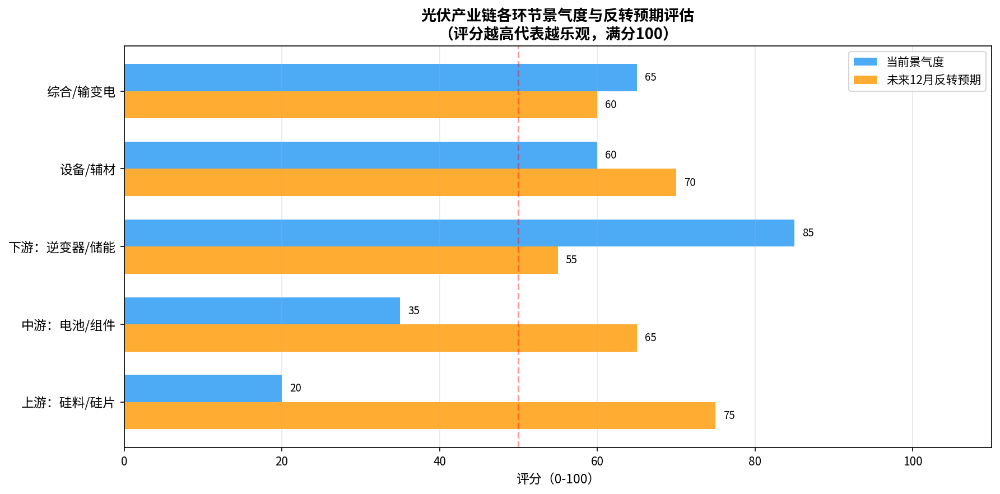
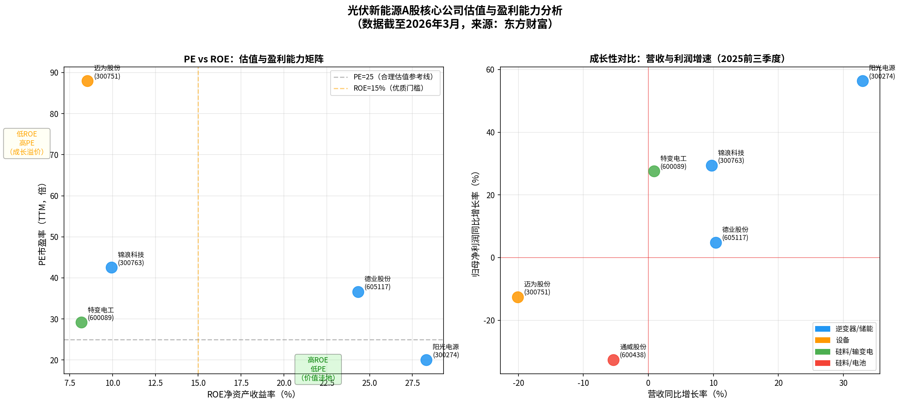
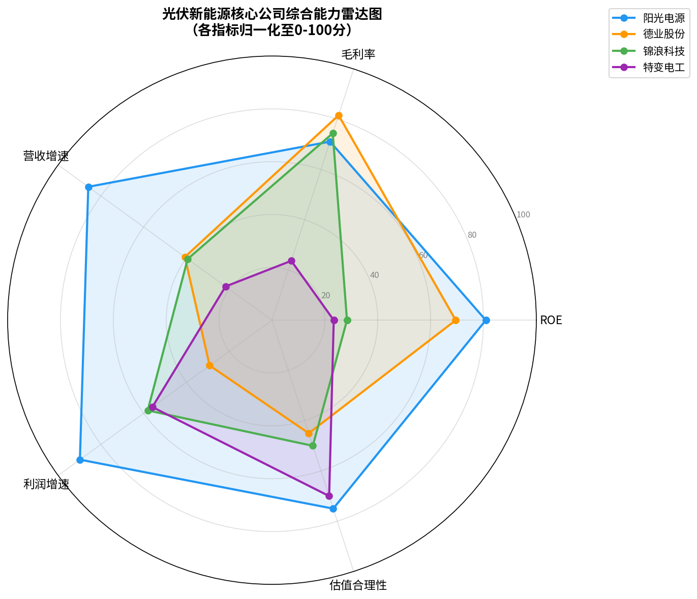

## 光伏与新能源A股可行性投资报告

**报告日期**：2026年3月4日

**撰写人**：Manus AI

### 核心摘要

本报告基于您提供的投资大师选股策略体系，结合对光伏与新能源行业A股核心上市公司的最新财务数据分析，旨在筛选出具备长期投资价值的优质标的。通过对行业景气度、公司盈利能力、估值水平及成长性的综合评估，我们认为，尽管行业上游（硅料/硅片）短期承压，但**下游的逆变器与储能环节依然维持高景气度，是当前阶段最具吸引力的投资赛道**。

在众多候选公司中，**阳光电源 (300274.SZ)** 在各项核心指标中均表现出众，集高盈利能力（ROE 28.31%）、强劲增长（利润增速56.34%）与相对合理的估值（PE TTM 20.04倍）于一身，综合实力领跑行业，是当前阶段的首选投资标的。同时，**德业股份 (605117.SH)** 也展现了卓越的盈利能力和技术优势，但估值相对较高，建议在价格回调时关注。而上游企业如通威股份则因行业周期性影响，短期面临较大经营压力，投资风险较高。

---

### 一、 行业概览：下游景气度高，上游期待反转

光伏行业作为实现“碳中和”目标的核心路径之一，长期发展空间广阔。然而，产业链不同环节的景气度在当前阶段出现显著分化。根据我们的分析，如下图所示：

*图1：光伏产业链各环节景气度与反转预期评估* [1]

- **下游（逆变器/储能）**：当前景气度评分高达85分，显著领先其他环节。这主要得益于全球光储需求的持续旺盛，特别是海外市场的强劲增长。头部企业凭借技术、品牌和渠道优势，充分享受行业红利。
- **上游（硅料/硅片）**：当前景气度仅为20分，处于周期底部。过去两年的产能过剩导致产品价格大幅下跌，相关企业盈利能力急剧恶化。但市场对其未来12个月的反转预期也最高（75分），显示出对产能出清后价格回暖的强烈期待。
- **中游（电池/组件）**：面临上下游双重挤压，景气度一般（35分），但同样具备一定的反转预期（65分）。

**结论**：依据“投资景气度高的优势赛道”原则，当前应重点关注下游的逆变器和储能领域。

### 二、 核心公司对标分析：谁是王者？

我们选取了产业链各环节的代表性公司，从“盈利能力 vs 估值”和“成长性”两个维度进行交叉对比。

*图2：核心公司PE-ROE及成长性矩阵* [1]

根据您的投资哲学，理想的投资标的应位于图2左侧的“高ROE-低PE”价值洼地，并同时出现在图2右侧的“高增长”象限。

1.  **盈利能力与估值（PE-ROE图）**：
    - **阳光电源** 和 **德业股份** 明显处于“高ROE”区间（>15%），展现了卓越的股东回报能力。
    - 其中，**阳光电源** 的PE（TTM）约为20倍，相对于其接近30%的ROE，估值极具吸引力，落入“价值洼地”的黄金区域。
    - **德业股份** 的PE（TTM）约为37倍，虽然ROE同样出色，但估值溢价较高。
    - 其他公司或因ROE较低，或因PE过高/为负，吸引力相对较弱。

2.  **成长性（营收-利润增速图）**：
    - **阳光电源** 再次脱颖而出，以超过30%的营收增速和超过50%的利润增速，成为无可争议的“成长领袖”。
    - **锦浪科技** 和 **特变电工** 也维持了正向的利润增长，但营收增速较缓。
    - **迈为股份** 和 **通威股份** 则陷入营收和利润的双重负增长，反映了其所在环节的经营困境。

### 三、 综合能力评估与最终筛选

为进行更全面的评估，我们构建了包含盈利能力、成长性、估值合理性等多个维度的综合能力雷达图。

*图3：核心公司综合能力雷达图* [1]

从上图可以直观看出，**阳光电源** 的雷达图面积最大，各项指标均表现均衡且强大，尤其在ROE、营收增速和利润增速方面遥遥领先，综合得分最高。

**最终筛选结果如下表所示：**

| 公司名称 | 股票代码 | 投资评级 | 核心逻辑 | 主要风险 |
| :--- | :--- | :--- | :--- | :--- |
| **阳光电源** | 300274.SZ | **强烈推荐** | 1. **赛道龙头**：全球逆变器与储能系统双料冠军。 2. **高盈利高增长**：ROE(28%)与利润增速(56%)兼备。 3. **估值合理**：PE(20x)显著低于历史均值与同业水平。 4. **全球化布局**：海外收入占比高，有效分散风险。 | 国际贸易政策变化；汇率大幅波动；储能需求不及预期。 |
| **德业股份** | 605117.SH | **建议关注** | 1. **技术领先**：微型逆变器技术壁垒高，毛利率(39%)领先。 2. **盈利能力强**：ROE(24%)同样出色。 3. **产品线丰富**：从逆变器到储能系统，协同效应强。 | 估值偏高（PE 37x）；单一市场依赖风险（需关注其全球化进展）。 |
| **特变电工** | 600089.SH | **中性** | 1. **业务多元化**：硅料+输变电双主业，具备一定防御性。 2. **估值较低**：PB(2.25x)和PE(29x)相对不高。 | 硅料价格持续低迷；输变电业务增长缓慢；盈利能力（ROE 8%）偏弱。 |

### 四、 投资策略建议

基于以上分析，我们建议采取“核心-卫星”策略进行布局：

- **核心仓位（60%-70%）**：配置于 **阳光电源**。作为行业领导者，其基本面扎实，估值具备安全边际，有望实现长期的戴维斯双击（业绩增长+估值修复）。

- **卫星仓位（30%-40%）**：
    - **德业股份**：等待估值回调至合理区间（如PE回落至25-30倍）后，可作为增强弹性的配置。
    - **产业链上游/中游**：对于风险偏好较高的投资者，可在观察到明确的行业反转信号（如产品价格连续上涨、库存显著下降）后，少量布局相关龙头股（如通威股份），以博取周期反转带来的超额收益。

**免责声明**：本报告仅为基于公开信息的投资分析，不构成任何具体的投资建议。股市有风险，投资需谨慎。

---

### 参考资料

[1] 数据来源：东方财富网，截至2026年3月3日的公开财务数据。
