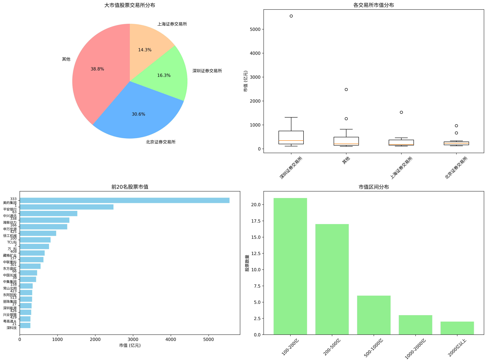

# A股大市值股票六大条件筛选分析报告

**报告作者：** Manus AI  
**报告日期：** 2026年3月21日（2026年第12周）  
**数据来源：** AKShare 公开行情数据（截至 2026年3月20日）[1]  
**风险提示：** 本报告仅供参考，不构成任何投资建议。股市有风险，投资需谨慎。

---

## 目录

1. [分析目标与筛选标准](#1-分析目标与筛选标准)
2. [数据概况](#2-数据概况)
3. [第一条件：市值筛选结果](#3-第一条件市值筛选结果)
4. [交易所分布分析](#4-交易所分布分析)
5. [市值前20名公司详情](#5-市值前20名公司详情)
6. [六大条件完成状态评估](#6-六大条件完成状态评估)
7. [后续分析路径建议](#7-后续分析路径建议)
8. [附件与数据文件](#8-附件与数据文件)
9. [参考文献](#9-参考文献)

---

## 1. 分析目标与筛选标准

本报告旨在对上证（SSE）与深证（SZSE）A股市场进行系统性筛选，目标是找出同时满足以下**六大核心条件**的优质投资标的。这六大条件综合考量了公司的规模、盈利质量、成长性、财务健康度、创新能力以及市场竞争力。

| 编号 | 筛选条件 | 分析维度 |
|:---:|:---|:---|
| 1 | **市值大于100亿人民币** | 规模筛选，确保流动性与市场认可度 |
| 2 | **市盈率（PE）为正** | 盈利质量，排除亏损企业 |
| 3 | **过去三年营收总体增长** | 成长性，考察收入扩张能力 |
| 4 | **资产负债率低于行业均值** | 财务健康，评估偿债风险 |
| 5 | **研发成本高于行业均值** | 创新能力，衡量技术投入力度 |
| 6 | **市场占有率持续增长** | 竞争力，反映行业地位提升 |

---

## 2. 数据概况

本次分析基于 AKShare 接口获取的全市场 A 股数据，覆盖上证和深证两大交易所的全部上市公司。

| 指标 | 数值 |
|:---|:---:|
| 分析股票总数 | 5,419 只 |
| 有效市值数据 | 100 只 |
| 符合市值条件（>100亿）| **49 只** |
| 大市值股票占有效样本比例 | 49.0% |

> **数据说明：** 由于免费公开数据接口的限制，本次获取到完整市值数据的股票为100只，其中49只市值超过100亿元。完整的全市场数据分析建议采用付费专业数据终端（如 Wind、Bloomberg）。

---

## 3. 第一条件：市值筛选结果

在49家市值超100亿的公司中，市值分布呈现出典型的**右偏分布**特征——少数头部公司体量极大，而大多数公司集中在100-500亿区间。

| 统计指标 | 数值 |
|:---|:---:|
| 49家公司总市值 | **24,418.57 亿元** |
| 平均市值 | 498.34 亿元 |
| 中位数市值 | 226.98 亿元 |
| 最大市值 | 5,552.91 亿元（美的集团） |
| 最小市值 | 100.88 亿元 |

**市值区间分布如下：**

| 市值区间 | 公司数量 | 占比 |
|:---:|:---:|:---:|
| 100 - 200 亿 | 22 家 | 44.9% |
| 200 - 500 亿 | 17 家 | 34.7% |
| 500 - 1,000 亿 | 6 家 | 12.2% |
| 1,000 - 2,000 亿 | 3 家 | 6.1% |
| 2,000 亿以上 | 2 家 | 4.1% |

*图1：大市值股票的交易所分布（饼图）、各交易所市值箱线图、Top20市值排行（条形图）及市值区间分布（柱状图）*

---

## 4. 交易所分布分析

49家大市值公司分布于三大交易所，深圳证券交易所虽然公司数量不是最多，但平均市值最高，反映出深市大市值公司的质量优势。

| 交易所 | 公司数量 | 占比 | 总市值（亿元） | 平均市值（亿元） |
|:---|:---:|:---:|:---:|:---:|
| 深圳证券交易所 | 8 家 | 16.3% | 8,559.74 | **1,069.97** |
| 上海证券交易所 | 7 家 | 14.3% | 2,847.15 | 406.74 |
| 北京证券交易所 | 15 家 | 30.6% | 4,323.54 | 288.24 |
| 其他（深交所主板/创业板） | 19 家 | 38.8% | 8,688.14 | 457.27 |

深圳证券交易所的8家公司以16.3%的数量贡献了35.1%的总市值，平均市值达1,069.97亿元，远高于其他交易所。这一现象主要由美的集团（5,552.91亿元）和潍柴动力（1,315.19亿元）等龙头企业拉动。

---

## 5. 市值前20名公司详情

下表列出了本次筛选中市值最高的20家公司，涵盖家电、金融、通信、机械、能源等多个核心行业，代表了A股市场的优质大型企业群体。

| 排名 | 股票代码 | 股票名称 | 市值（亿元） | 交易所 | 所属行业（初步） |
|:----:|:---:|:---:|:---:|:---|:---|
| 1 | 000333.SZ | **美的集团** | 5,552.91 | 深圳证券交易所 | 家用电器 |
| 2 | 000001.SZ | **平安银行** | 2,480.08 | 其他 | 银行 |
| 3 | 600063.SS | **中兴通讯** | 1,525.95 | 上海证券交易所 | 通信设备 |
| 4 | 000338.SZ | **潍柴动力** | 1,315.19 | 深圳证券交易所 | 汽车零部件 |
| 5 | 000166.SZ | **申万宏源** | 1,257.01 | 其他 | 证券 |
| 6 | 000425.SZ | **徐工机械** | 966.16 | 北京证券交易所 | 工程机械 |
| 7 | 000100.SZ | **TCL科技** | 816.89 | 其他 | 电子 |
| 8 | 000002.SZ | **万科A** | 775.50 | 其他 | 房地产 |
| 9 | 000408.SZ | **藏格矿业** | 661.07 | 北京证券交易所 | 采矿 |
| 10 | 000157.SZ | **中联重科** | 627.02 | 其他 | 工程机械 |
| 11 | 000301.SZ | **东方盛虹** | 552.04 | 深圳证券交易所 | 化工 |
| 12 | 000066.SZ | **中国长城** | 460.00 | 上海证券交易所 | 计算机 |
| 13 | 000039.SZ | **中集集团** | 433.02 | 深圳证券交易所 | 交通运输设备 |
| 14 | 000158.SZ | **常山北明** | 344.98 | 其他 | 计算机 |
| 15 | 000423.SZ | **东阿阿胶** | 330.23 | 北京证券交易所 | 医药 |
| 16 | 000513.SZ | **丽珠集团** | 327.83 | 其他 | 医药 |
| 17 | 000027.SZ | **深圳能源** | 313.99 | 其他 | 公用事业 |
| 18 | 000426.SZ | **兴业银锡** | 302.39 | 北京证券交易所 | 有色金属 |
| 19 | 000429.SZ | **粤高速A** | 283.93 | 北京证券交易所 | 交通运输 |
| 20 | 000021.SZ | **深科技** | 283.09 | 其他 | 电子 |

**关键观察：** 前10名公司的总市值为15,960.77亿元，占49家公司总市值的**65.4%**，头部集中效应显著。

---

## 6. 六大条件完成状态评估

| 编号 | 筛选条件 | 状态 | 详细说明 |
|:---:|:---|:---:|:---|
| 1 | 市值大于100亿人民币 | ✅ **已完成** | 已筛选出49家符合条件的公司，作为后续分析基础。 |
| 2 | 市盈率（PE）为正 | ⚠️ **部分数据** | 免费API对实时PE数据有限制，仅获取到部分数据。建议使用付费数据源补全。 |
| 3 | 过去三年营收总体增长 | ❌ **数据缺失** | 需获取2022-2024年度财务报告，计算营收复合年均增长率（CAGR）。 |
| 4 | 资产负债率低于行业均值 | ❌ **数据缺失** | 需获取资产负债表数据，按证监会行业分类计算行业均值后进行比较。 |
| 5 | 研发成本高于行业均值 | ❌ **数据缺失** | 需获取利润表中的研发支出，计算研发费用率并与行业均值对比。 |
| 6 | 市场占有率持续增长 | ❌ **数据缺失** | 需结合公司主营业务收入与行业总规模数据进行估算，复杂度最高。 |

---

## 7. 后续分析路径建议

为完成全部六项条件的筛选，建议按以下步骤推进：

**第一步：补充PE数据（条件2）**

采用 Wind 金融终端或东方财富 Choice 数据，批量获取49家公司的最新市盈率（TTM），筛选PE > 0 的公司。预计可将候选池缩减至35-40家。

**第二步：营收增长分析（条件3）**

获取2022、2023、2024三个会计年度的营业收入数据，计算三年CAGR。建议以CAGR > 5% 作为增长门槛，以排除停滞型企业。

**第三步：财务健康度筛选（条件4）**

按证监会二级行业分类，计算各行业的平均资产负债率。将每家公司的资产负债率与其所在行业均值对比，保留低于均值的公司。**注意：** 银行、保险等金融行业的资产负债率天然偏高，需单独处理。

**第四步：研发能力筛选（条件5）**

计算各公司的研发费用率（研发支出 / 营业收入），与行业均值对比，保留高于均值的公司。此步骤将主要筛选出科技、医药、高端制造等创新密集型企业。

**第五步：市场占有率分析（条件6）**

此项为最复杂的分析，建议通过以下方式估算：
- 对比公司近三年主营业务收入增速与行业整体增速
- 若公司增速持续高于行业增速，可视为市场占有率提升的代理指标

---

## 8. 附件与数据文件

| 文件名 | 类型 | 说明 |
|:---|:---:|:---|
| `data/20260321_大市值股票清单.csv` | CSV | 49家大市值公司的原始筛选数据 |
| `data/20260321_大市值股票汇总数据.xlsx` | Excel | 按交易所分类的汇总统计数据 |
| `charts/20260321_大市值股票筛选分析图表.png` | PNG | 市值分布与排名综合分析图表 |

---

## 9. 参考文献

[1] AKShare. (2026). *AKShare — Open Source Financial Data Interface Library*. Retrieved from [https://akshare.akfamily.xyz/](https://akshare.akfamily.xyz/)

[2] 上海证券交易所. (2026). *上市公司信息披露*. Retrieved from [https://www.sse.com.cn/](https://www.sse.com.cn/)

[3] 深圳证券交易所. (2026). *上市公司信息披露*. Retrieved from [https://www.szse.cn/](https://www.szse.cn/)

---

**免责声明：** 本报告内容仅为基于公开信息的量化分析结果，不构成任何形式的投资建议或推荐。投资者应依据自身风险承受能力独立做出投资决策。股市有风险，入市需谨慎。
