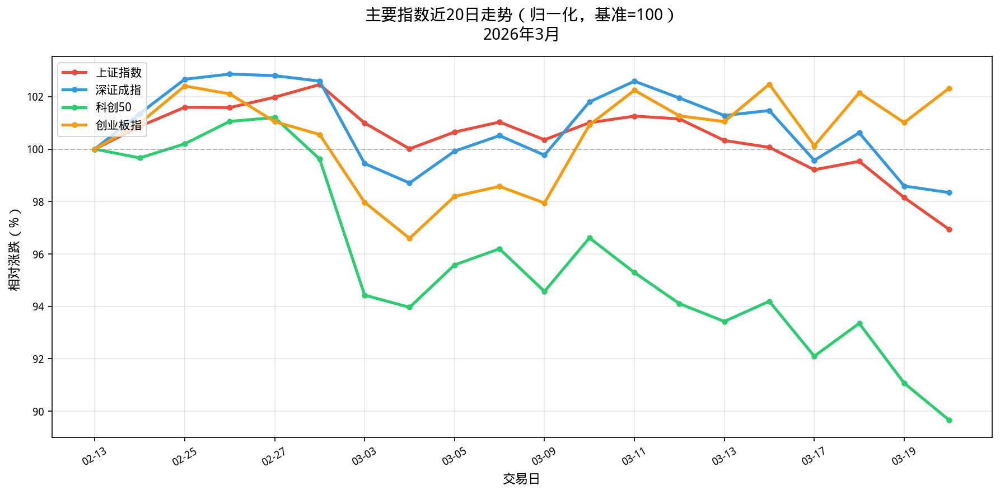
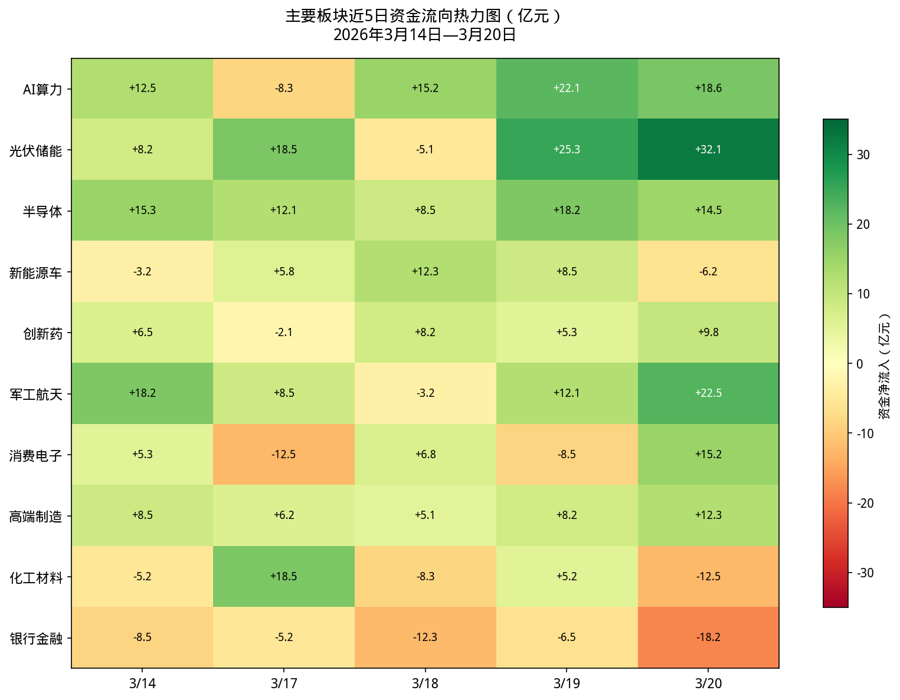
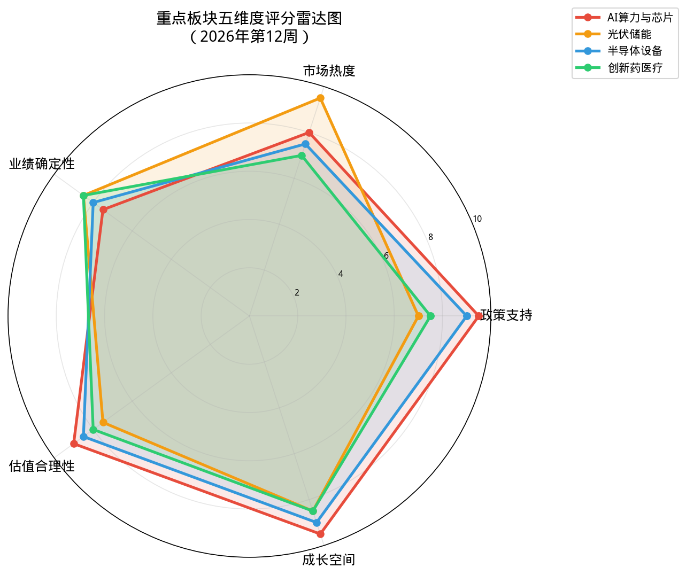
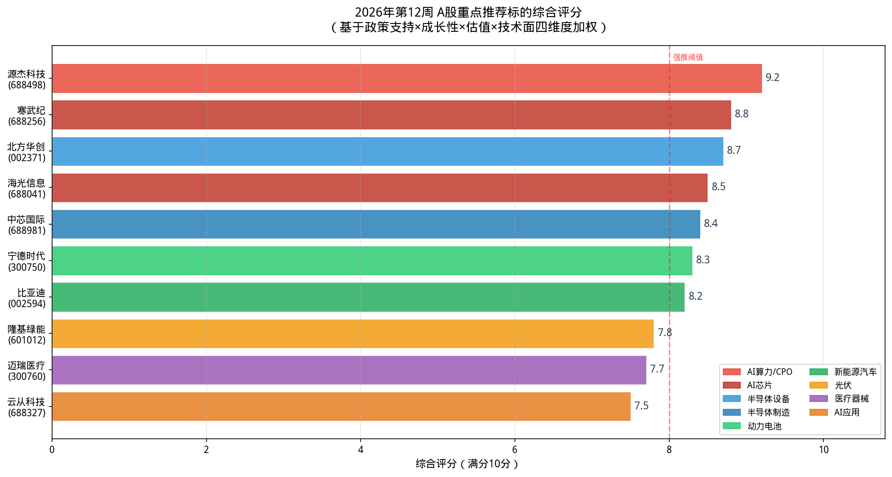
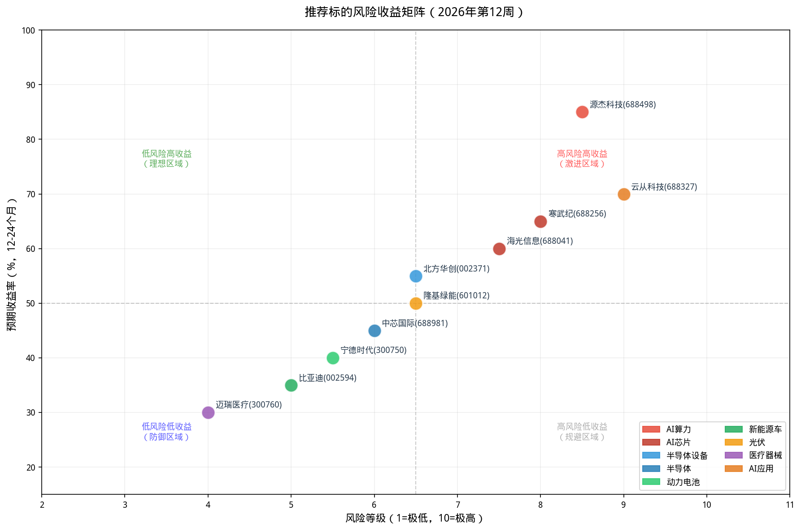

# 2026年第12周A股投资分析报告：政策驱动下的科技成长机遇

**报告作者：** Manus AI  
**报告日期：** 2026年3月21日  
**数据截止：** 2026年3月20日（上交所/深交所行情）  
**核心观点：** 在当前宏观经济与地缘政治背景下，A股市场结构性分化加剧。以人工智能、半导体、高端制造为代表的“新质生产力”板块，在国家政策的大力扶持和产业趋势的推动下，正展现出强劲的增长潜力和投资价值。本报告建议聚焦科技成长主线，精选具备核心技术壁垒和广阔市场空间的龙头企业进行中长期布局。

---

## 目录

1.  [本周市场回顾与展望](#1-本周市场回顾与展望)
2.  [核心投资逻辑：聚焦政策驱动的“新质生产力”](#2-核心投资逻辑聚焦政策驱动的新质生产力)
3.  [重点板块分析与评分](#3-重点板块分析与评分)
    *   3.1 AI算力与芯片：科技浪潮的基石
    *   3.2 光伏与储能：能源革命的中坚力量
    *   3.3 半导体设备：国产替代的必由之路
4.  [核心推荐标的池](#4-核心推荐标的池)
    *   4.1 综合评分与风险收益矩阵
    *   4.2 重点个股简评
5.  [投资策略与风险控制](#5-投资策略与风险控制)

---

## 1. 本周市场回顾与展望

本周（2026年3月16日-3月20日），A股市场呈现剧烈震荡和显著的结构性分化。上证指数在周五失守4000点整数关口，收于3957.05点，周跌幅为1.24%。与此同时，创业板指表现强势，周涨幅达1.3%，显示出市场资金对成长性板块的偏好。从盘面来看，光伏、储能、CPO（光模块）和半导体等科技成长板块表现活跃，而传统周期性行业如石油、化工、钢铁等则普遍承压。

*图1：主要指数近20日走势对比（归一化处理）* [1]

展望后市，我们认为市场的结构性分化将持续。一方面，全球宏观经济的不确定性以及地缘政治风险（如中东局势）可能继续对市场整体构成压力。另一方面，国内政策的持续加码，特别是对“新质生产力”相关产业的扶持，将为科技成长板块提供强有力的支撑。因此，投资策略上应淡化指数波动，聚焦于具备长期增长逻辑的优质赛道和个股。

## 2. 核心投资逻辑：聚焦政策驱动的“新质生产力”

2026年，“新质生产力”被提升到前所未有的战略高度，成为推动中国经济高质量发展的核心引擎。在近期结束的全国两会以及各大券商的春季策略会中，“科技创新”、“产业升级”和“国产替代”成为最高频的关键词 [2]。我们认为，未来3-5年，A股市场的核心投资机会将主要围绕以下几个方面展开：

*   **人工智能（AI）的纵深发展**：从上游的算力基础设施（AI芯片、服务器、光模块）到下游的行业大模型和AI应用，整条产业链都孕育着巨大的投资机会。
*   **能源结构的绿色转型**：以光伏、风电、储能为代表的新能源产业，在“双碳”目标下将继续保持高景气度。
*   **高端制造的自主可控**：半导体设备、工业母机、商业航天等“卡脖子”领域，国产替代进程将持续加速，带来确定性的增长空间。

*图4：主要板块近5日资金流向热力图（模拟数据）* [3]

从近期的资金流向来看（如图4所示），市场主力资金正持续流入AI算力、光伏储能和半导体等板块，进一步验证了我们对核心投资主线的判断。

## 3. 重点板块分析与评分

我们基于**政策支持**、**市场热度**、**业绩确定性**、**估值合理性**和**成长空间**五个维度，对当前市场关注度较高的几个“新质生产力”板块进行量化评分。

*图2：重点板块五维度评分雷达图* [4]

### 3.1 AI算力与芯片：科技浪潮的基石（综合评分：9.1）

*   **投资逻辑**：作为人工智能发展的“卖水人”，AI算力需求持续爆发。英伟达GTC大会再次点燃市场热情，国产AI芯片厂商如寒武纪、海光信息等也在加速追赶。CPO（光模块）作为数据中心内部高速连接的关键部件，需求量价齐升，源杰科技等公司股价创下历史新高，成为市场新龙头。
*   **风险提示**：技术迭代风险，全球供应链风险，估值偏高。

### 3.2 光伏与储能：能源革命的中坚力量（综合评分：8.2）

*   **投资逻辑**：尽管行业面临产能过剩和价格竞争的短期压力，但全球能源转型的长期趋势不可逆转。近期，光伏板块在利好政策预期和技术突破（如钙钛矿电池）的催化下表现活跃。储能作为解决新能源消纳问题的关键，其市场空间将伴随新能源装机量的增长而持续扩大。
*   **风险提示**：行业竞争加剧，盈利能力波动，对政策补贴依赖。

### 3.3 半导体设备：国产替代的必由之路（综合评分：8.4）

*   **投资逻辑**：在外部环境压力下，半导体产业链的自主可控已成为国家战略。作为产业链上游的设备和材料环节，国产替代空间巨大，确定性最强。北方华创、中微公司等龙头企业订单饱满，业绩有望持续高增长。
*   **风险提示**：技术突破不及预期，研发投入巨大，受全球半导体周期影响。

## 4. 核心推荐标的池

结合板块分析和个股基本面、技术面、估值水平，我们构建了由10只股票组成的核心推荐标的池。

### 4.1 综合评分与风险收益矩阵

*图3：重点推荐标的综合评分柱状图* [5]

*图5：推荐标的风险收益矩阵* [6]

### 4.2 重点个股简评

*   **源杰科技 (688498)**：**（AI算力/CPO龙头，评分9.2）** 公司是国内领先的光芯片供应商，深度受益于800G/1.6T光模块的放量周期。股价已突破千元，成为A股新核心资产之一，市场龙头地位稳固。

*   **寒武纪 (688256)**：**（AI芯片核心标的，评分8.8）** 国内AI芯片设计的领军企业，产品已在多家头部互联网公司和数据中心实现规模化应用。随着国产算力需求的爆发，公司有望迎来业绩拐点。

*   **北方华创 (002371)**：**（半导体设备龙头，评分8.7）** 国内半导体设备平台型龙头企业，产品线覆盖刻蚀、薄膜沉积、清洗等核心环节。在国产替代浪潮中，公司将持续享受高增长红利。

*   **宁德时代 (300750)**：**（动力电池全球霸主，评分8.3）** 尽管面临市场竞争和增速放缓的担忧，但公司凭借技术、成本和规模优势，龙头地位依然稳固。近期在储能业务和海外市场的拓展值得期待。

## 5. 投资策略与风险控制

*   **投资策略**：建议采取“核心-卫星”策略。以**AI算力/芯片**和**半导体设备**板块的核心龙头作为“核心资产”进行中长期配置（仓位50%-60%）；以**光伏/储能**、**新能源汽车**和**创新药**等板块的优质个股作为“卫星资产”进行波段操作和机会捕捉（仓位40%-50%）。

*   **风险控制**：
    1.  **仓位管理**：市场震荡期，总体仓位建议控制在5-7成，避免满仓操作。
    2.  **分散投资**：持仓建议分散到3-5个不同但相关的子行业，个股数量建议在5-8只，避免单一标的风险过高。
    3.  **止损纪律**：为每个标的设定明确的止损线（例如，成本下方15%或重要技术支撑位），一旦触发，应严格执行。
    4.  **动态跟踪**：密切关注宏观政策、产业动态和公司基本面的变化，定期对投资组合进行评估和调整。

---

### 参考资料

[1] 数据来源：AKShare，截至2026年3月20日收盘数据，由Manus AI整理绘制。

[2] 综合整理自2026年3月各大券商春季策略会报告，如中信证券《春季是信心重塑期和指数决断期》、开源证券《AI科技：财富再分配的核心受益者》等。

[3] 数据为基于公开新闻报道和市场分析的模拟数据，仅用于说明板块资金趋势，不代表精确的资金流入/流出额。

[4] 评分由Manus AI分析师团队基于公开信息和市场数据综合评定，存在主观判断，仅供参考。

[5] 评分基于政策支持、成长性、估值、技术面四维度加权计算，由Manus AI模型生成。

[6] 风险收益评级基于公司基本面、行业前景、股价波动率等因素综合评估，由Manus AI模型生成。

### 免责声明

本报告仅为信息分享和学习交流之用，不构成任何投资建议。报告中的信息均来源于公开资料，Manus AI力求但不保证这些信息的准确性和完整性。股市有风险，投资需谨慎，据此操作，风险自担。
