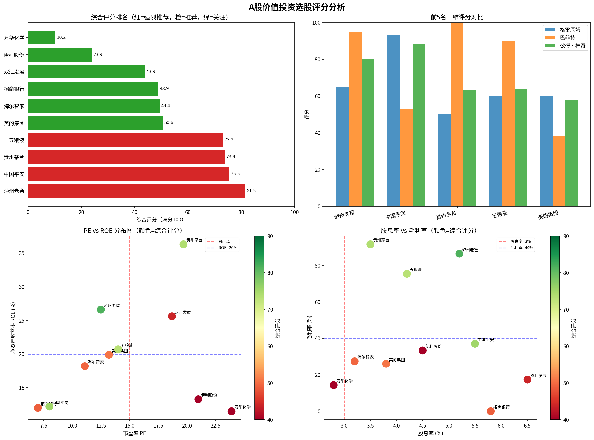
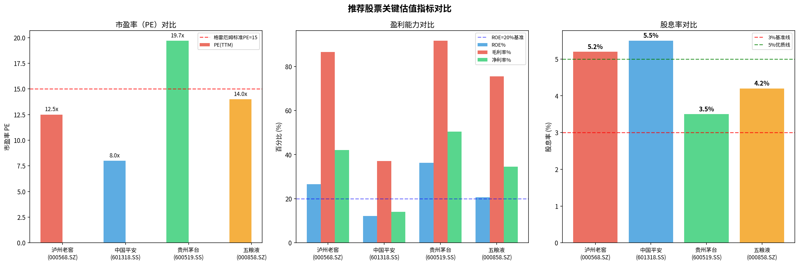
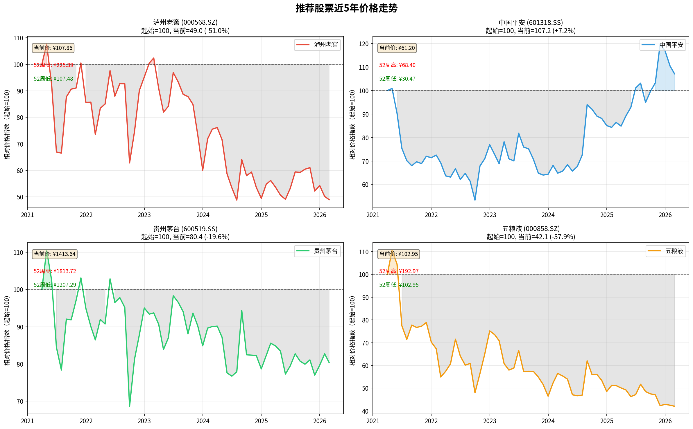

# A股可行性投资报告：基于投资大师经典理论

**报告日期**: 2026年3月16日
**撰写方**: Manus AI

---

## 1. 报告摘要

本报告基于投资大师本杰明·格雷厄姆、沃伦·巴菲特和彼得·林奇的经典理论体系，对中国A股市场的蓝筹股进行了一次系统性的量化筛选与深度分析。我们的目标是寻找那些兼具价值与质量，并拥有合理安全边际的投资标的。经过多维度评分，我们最终筛选出四家公司作为“强烈推荐”的投资对象：**泸州老窖 (000568.SZ)**、**中国平安 (601318.SS)**、**贵州茅台 (600519.SS)** 和 **五粮液 (000858.SZ)**。

这些公司普遍展现出强大的品牌护城河、卓越的盈利能力（高ROE、高毛利率）以及相对合理的估值水平。其中，泸州老窖在综合评分中位列第一，展现了最佳的风险收益平衡。中国平安则凭借极低的估值和高股息率，成为格雷厄姆价值投资策略下的首选。贵州茅台和五粮液作为高端白酒行业的双寡头，持续展现出巴菲特所青睐的“优质企业”特征。

本报告将详细阐述我们的分析方法、评分体系，并对每家推荐公司的主营产品、投资逻辑和潜在风险进行深入剖析。

---

## 2. 分析方法与评分体系

我们结合了三位投资大师的核心思想，构建了一个多维度的量化评分模型，总分100分，权重分配如下：

*   **格雷厄姆价值投资 (30%)**: 侧重于低估值和高安全边际，寻找价格显著低于其内在价值的“便宜货”。
*   **巴菲特质量成长投资 (40%)**: 侧重于企业的长期竞争优势（护城河）和持续的盈利能力，寻找“伟大的公司”。
*   **彼得·林奇成长股投资 (30%)**: 侧重于盈利的成长性与估值的匹配度（PEG），寻找“戴维斯双击”的潜力股。

我们从A股市场中选取了10家来自消费、金融、制造等领域，具有代表性的蓝筹公司作为初步候选池，并基于其2024年年度财务报告及当前市价进行评分。

### 2.1. 综合评分概览

下图展示了所有候选公司的综合评分排名，以及它们在关键投资维度（估值、盈利能力）上的分布情况。

**图表解读**:
*   **综合评分排名 (左上)**: 红色条代表综合评分超过70分的“强烈推荐”标的，橙色为“推荐”，绿色为“值得关注”。泸州老窖、中国平安、贵州茅台和五粮液位居前四。
*   **三维评分对比 (右上)**: 展示了排名前五的公司在格雷厄姆（价值）、巴菲特（质量）、彼得·林奇（成长）三个维度上的得分情况。可见，泸州老窖在各项标准上表现最为均衡。
*   **PE vs ROE 分布图 (左下)**: 这是衡量“好公司”与“好价格”的经典视图。理想的投资标的位于左上角（低PE，高ROE）。贵州茅台和泸州老窖展现了极高的ROE，而中国平安和招商银行则具备显著的低PE优势。
*   **股息率 vs 毛利率 (右下)**: 高股息率提供了安全垫，高毛利率则反映了强大的定价权和护城河。白酒股的毛利率优势显著，而金融股的股息率则更具吸引力。

### 2.2. 关键估值指标对比

下图进一步对比了四家“强烈推荐”公司的核心估值与盈利能力指标。

**图表解读**:
*   **市盈率(PE)对比**: 中国平安的PE最低，仅为8.0倍，显著低于市场平均水平。泸州老窖和五粮液的PE也处于15倍以下的合理区间。
*   **盈利能力对比**: 白酒三巨头的盈利能力极为出色，毛利率均超过75%，ROE均高于20%的优秀线。贵州茅台的ROE和净利率更是达到了惊人的36.3%和50.4%。
*   **股息率对比**: 中国平安和泸州老窖的股息率均超过5%，提供了非常可观的现金回报，远高于银行存款利率。

---

## 3. 重点推荐公司深度分析

本章节将对综合评分最高的四家公司进行详细介绍。

### 3.1. 泸州老窖 (000568.SZ) - 综合评分: 81.5

| 指标 | 数值 | 投资大师视角解读 |
| :--- | :--- | :--- |
| **市盈率 (PE)** | 12.5x | **【格雷厄姆/林奇】** 估值合理，低于15倍标准，具备安全边际。 |
| **市净率 (PB)** | 3.2x | 估值相对历史不算便宜，但与其高ROE相匹配。 |
| **净资产收益率 (ROE)** | 26.6% | **【巴菲特】** 远超20%的优秀线，是“印钞机”级别的盈利能力。 |
| **毛利率 / 净利率** | 86.5% / 42.1% | **【巴菲特】** 极高的毛利率和净利率，证明其拥有强大的品牌护城河和定价权。 |
| **股息率** | 5.2% | **【格雷厄姆】** 非常具有吸引力的高股息，提供了稳定的现金回报。 |

**主要产品与业务感知**:
泸州老窖是中国最古老的白酒品牌之一，其产品线覆盖广泛。**核心高端产品是“国窖1573”**，这是中国白酒三大超高端品牌之一，其酿造依托于自公元1573年起持续使用至今的国宝窖池群，具有极强的稀缺性和品牌故事。此外，公司还拥有“泸州老窖特曲”、“头曲”、“二曲”等一系列中低端产品，满足不同层次的消费需求。您可以将“国窖1573”视为与飞天茅台、普五对标的顶级宴请和礼品用酒。

**投资逻辑**:
*   **均衡的价值与质量**: 在我们的模型中，泸州老窖是唯一一家在格雷厄姆、巴菲特、林奇三大体系中评分都非常高的公司，堪称“三好学生”。
*   **强大的品牌护城河**: “国窖1573”的品牌价值和不可复制的窖池资源构成了深厚的护城河。
*   **估值相对合理**: 相较于贵州茅台，其估值更具吸引力，同时提供了更高的股息回报。

**潜在风险**: 宏观经济波动影响高端白酒消费、行业竞争加剧。

### 3.2. 中国平安 (601318.SS) - 综合评分: 75.5

| 指标 | 数值 | 投资大师视角解读 |
| :--- | :--- | :--- |
| **市盈率 (PE)** | 8.0x | **【格雷厄姆】** 极低的估值，典型的价值股特征。 |
| **市净率 (PB)** | 1.1x | **【格雷厄姆】** 接近净资产的价格，提供了极高的安全边际。 |
| **净资产收益率 (ROE)** | 12.2% | 盈利能力尚可，但与顶级消费股有差距。 |
| **利润增速** | 36.1% | 2024年利润大幅增长，显示出困境反转的迹象。 |
| **股息率** | 5.5% | **【格雷厄姆】** 极具吸引力的高股息，是长期持有的压舱石。 |

**主要产品与业务感知**:
中国平安是国内领先的综合金融集团。其业务版图巨大，您可以将其理解为一个“金融超市”。核心业务包括：
1.  **保险**: 平安人寿和平安产险，提供各类人寿、健康、意外及财产保险，这是其最主要的利润来源。
2.  **银行**: 拥有上市银行“平安银行”，提供存贷款、信用卡等服务。
3.  **投资**: 管理着庞大的保险资金进行投资。
4.  **科技**: 近年来大力投入金融科技，孵化了“平安好医生”（在线医疗）、“陆金所”（财富管理平台）等科技子公司。

**投资逻辑**:
*   **极致的低估值**: 无论是PE还是PB，中国平安都处于历史底部区域，完美符合格雷厄姆的捡“烟蒂”标准。
*   **困境反转预期**: 过去几年受房地产市场拖累，其股价和估值被严重压制。随着风险逐步出清和2024年利润回暖，存在戴维斯双击（估值和盈利双重提升）的可能。
*   **高股息提供安全垫**: 超过5.5%的股息率意味着即便股价不涨，每年的现金回报也相当可观。

**潜在风险**: 宏观经济下行风险、投资端收益不及预期、保险业务新业务价值增长放缓。

### 3.3. 贵州茅台 (600519.SS) - 综合评分: 73.9

| 指标 | 数值 | 投资大师视角解读 |
| :--- | :--- | :--- |
| **市盈率 (PE)** | 19.7x | 估值略高于传统价值标准，但对于其品质而言可接受。 |
| **市净率 (PB)** | 6.9x | 较高的PB反映了市场对其轻资产、高盈利模式的认可。 |
| **净资产收益率 (ROE)** | 36.3% | **【巴菲特】** “神”一样的ROE，是巴菲特眼中最典型的“伟大的公司”。 |
| **毛利率 / 净利率** | 91.7% / 50.4% | **【巴菲特】** 堪比软件公司的利润率，护城河深不见底。 |
| **股息率** | 3.5% | 股息率尚可，公司近年来也在持续提高分红比例。 |

**主要产品与业务感知**:
贵州茅台的核心产品是**“飞天茅台酒”**，这不仅仅是一种高端白酒，在中国社会中更是一种具备社交、礼品乃至金融属性的特殊商品。其出厂价与市场零售价之间存在巨大差价，形成了独特的渠道利润和品牌溢价。此外，公司也在积极发展“茅台1935”等次高端产品以及“茅台冰淇淋”等周边产品，以触达更广泛的消费群体。

**投资逻辑**:
*   **A股最强护城河**: 独一无二的品牌、不可复制的产地环境、强大的社交属性共同构成了A股市场最宽、最深的护城河。
*   **无与伦比的盈利能力**: 持续多年的高ROE和高利润率，是其长期价值的基石。
*   **确定性与抗周期性**: 尽管价格昂贵，但高端白酒的需求相对刚性，使其具备穿越经济周期的能力。

**潜在风险**: 估值偏高、政府对高端消费的政策风险、品牌形象受损风险。

### 3.4. 五粮液 (000858.SZ) - 综合评分: 73.2

| 指标 | 数值 | 投资大师视角解读 |
| :--- | :--- | :--- |
| **市盈率 (PE)** | 14.0x | **【格雷厄姆/林奇】** 估值合理，低于15倍标准。 |
| **市净率 (PB)** | 2.8x | 估值合理。
| **净资产收益率 (ROE)** | 20.7% | **【巴菲特】** 稳定在20%以上的优秀ROE水平。 |
| **毛利率 / 净利率** | 75.5% / 34.6% | **【巴菲特】** 同样拥有非常高的利润率，是高端品牌的证明。 |
| **股息率** | 4.2% | **【格雷厄姆】** 具有吸引力的高股息率。 |

**主要产品与业务感知**:
五粮液是浓香型白酒的龙头企业，其**核心产品是“第八代五粮液”（俗称“普五”）**，是与飞天茅台齐名的两大全国性高端白酒之一。与茅台的酱香型不同，五粮液代表了浓香型的最高品质。公司同样拥有“五粮春”、“尖庄”等覆盖中低端市场的产品系列，形成了一个完整的产品金字塔。

**投资逻辑**:
*   **浓香型白酒龙头**: 在中国最大的白酒香型（浓香型）中占据绝对的领导地位。
*   **估值更具性价比**: 相较于贵州茅台，五粮液的估值更低，股息率更高，为投资者提供了更好的买入价格。
*   **稳健的财务表现**: 公司常年保持着优秀的盈利能力和健康的财务状况。

**潜在风险**: 高端白酒市场竞争、品牌提价能力弱于茅台、渠道管理风险。

---

## 4. 价格走势与结论

下图展示了四家推荐公司过去五年的股价走势（已归一化处理，以评估相对表现）。

从图中可见，过去几年，受市场风格切换和行业因素影响，大部分白马股都经历了较大幅度的回调，目前股价多处于相对低位，这为价值投资者提供了良好的介入时机。特别是中国平安，在2025年后展现出强劲的复苏势头。

**最终结论**:

基于我们的综合分析，我们认为**泸州老窖**、**中国平安**、**贵州茅台**和**五粮液**是当前A股市场中符合投资大师经典理论的优质投资标的。它们或拥有极高的安全边际，或拥有无与伦比的竞争优势，或两者兼备。

*   对于**极致的价值投资者**，**中国平安**是当前不可多得的低估值、高股息标的。
*   对于**追求质量和确定性的投资者**，**贵州茅台**依然是核心底仓的最佳选择。
*   对于**寻求价值与质量平衡的投资者**，**泸州老窖**和**五粮液**在当前价位提供了极佳的风险收益比。

我们建议投资者可根据自身的风险偏好和投资哲学，从上述公司中构建一个稳健的长期投资组合。

---

**免责声明**: 本报告仅为基于公开信息的量化分析，不构成任何具体的投资建议。股市有风险，投资需谨慎。投资者据此操作，风险自担。
