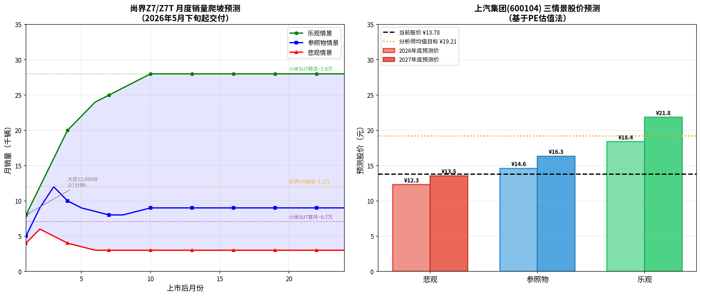
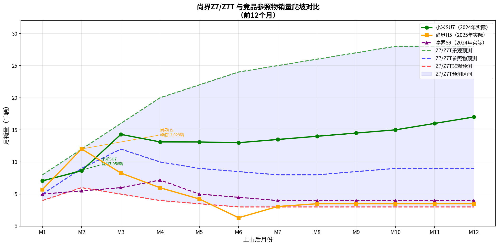
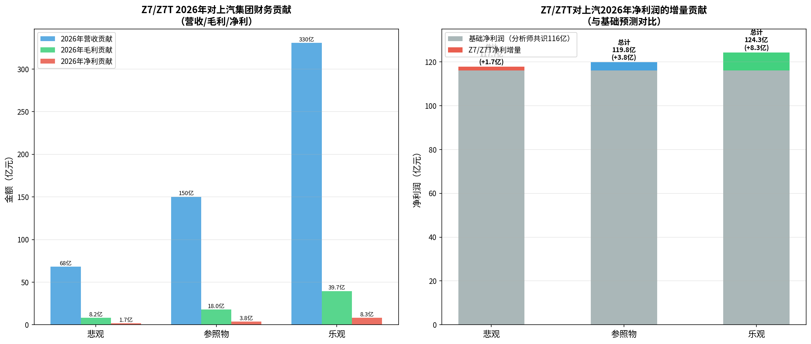
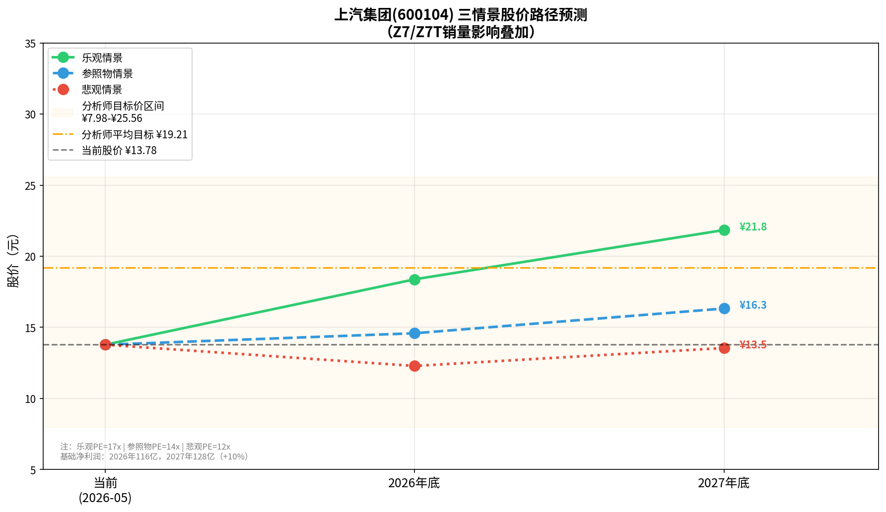

# 上汽集团（600104）投资分析报告：尚界Z7/Z7T上市影响及销量与股价预测

**作者：** Manus AI
**日期：** 2026年5月2日

## 1. 尚界Z7/Z7T产品概况与市场反响

2026年4月22日，上汽集团与华为鸿蒙智行合作的重磅车型——尚界Z7（风尚科技轿跑）与Z7T（风尚科技猎装）正式上市 [1]。新车起售价分别为21.98万元和22.98万元，直接切入20-30万元级中大型纯电轿车核心竞争红海。

在产品配置方面，Z7/Z7T全系标配华为乾崑ADS 896线激光雷达，具备高阶智能驾驶能力。动力系统提供单电机（264kW）与双电机（434kW）版本，最高续航里程达到905km（CLTC工况），在续航参数上略微超越了主要竞品小米SU7的902km [2]。

市场反响方面，Z7/Z7T展现出了极强的爆款潜质。新车上市仅27分钟，大定订单即突破12,000台，这一速度紧咬小米SU7创下的34分钟1.5万台纪录 [3]。据上汽集团总裁贾健旭透露，该系列车型的小订数量已突破8万台，其中95后用户占比超过60%，显示出对年轻消费群体的强大吸引力 [4]。新车预计将于2026年5月下旬正式开启交付。

## 2. 上汽集团财务现状与盈利结构分析

根据上汽集团发布的2025年年度报告，公司全年实现营业总收入6,562.44亿元，同比增长4.57%；归属于上市公司股东的净利润为101.06亿元，同比大幅增长506.45% [5]。

然而，深入分析其利润结构可以发现，上汽集团的盈利质量存在隐忧。2025年净利润的爆发式增长主要得益于非经常性损益的贡献。其中，投资收益高达134.33亿元，公允价值变动收益为66.05亿元，这两项非主业收益合计占净利润的绝大部分 [6]。

在整车主业方面，上汽集团2025年整车毛利率仅为4.30%左右。若剔除非经常性损益，按整车业务实际盈利推算，其单车净利润仅在660元至890元之间，远低于行业领先水平（如理想汽车约1.4万元/辆，比亚迪约7,000元/辆） [6]。因此，尚界Z7/Z7T作为高价值、高溢价（华为赋能）的车型，对于改善上汽集团的单车利润结构和主业盈利能力具有重要战略意义。

## 3. 尚界Z7/Z7T销量预测（三情景模型）

为了科学评估Z7/Z7T的销量前景，本报告选取了三款具有代表性的竞品车型作为参照物：
*   **小米SU7**：现象级爆款，上市首月交付7,058辆，随后快速爬坡，目前稳态月销维持在1.3万至2万辆以上 [7]。
*   **尚界H5**：上汽与华为合作的首款SUV，上市初期表现亮眼（峰值月销12,029辆），但随后呈现高开低走态势，目前月销回落至3,000辆左右 [8]。
*   **享界S9**：华为与北汽合作的高端轿车，上市首月交付约5,000辆，稳态月销在4,000辆左右 [9]。

基于上述参照物，我们构建了Z7/Z7T上市后24个月的销量爬坡模型，分为乐观、参照物、悲观三种情景：

| 情景假设 | 核心逻辑与对标对象 | 2026年预测销量（辆） | 2027年预测销量（辆） |
| :--- | :--- | :--- | :--- |
| **乐观情景** | 对标小米SU7。凭借华为品牌号召力、明星代言及庞大的小订基础，产能快速爬坡，稳态月销达到2.5万-2.8万辆。 | 137,700 | 335,000 |
| **参照物情景** | 综合尚界H5的峰值表现与享界S9的稳态表现。初期冲高后回落，稳态月销维持在8,000-10,000辆。 | 62,550 | 107,500 |
| **悲观情景** | 对标智界S7及尚界H5后期的低迷表现。市场热度迅速消退，稳态月销仅维持在3,000-4,000辆。 | 28,350 | 36,000 |

*(注：2026年销量按5月下旬起约7.5个月计算)*

## 4. 营收利润贡献与股价影响预测

基于上述销量预测，我们进一步测算Z7/Z7T对上汽集团（600104）的财务及股价影响。

**核心假设参数：**
*   Z7/Z7T加权平均售价：24.0万元
*   Z7/Z7T估算毛利率：12.0%（高于上汽均值，体现高端化溢价）
*   Z7/Z7T净利贡献率：2.5%（扣除华为技术分成及营销费用后）
*   上汽集团2026年基准净利润（不含Z7增量）：116.0亿元（基于多家券商分析师共识预测） [10]
*   上汽集团总股本：114.95亿股
*   当前股价（2026-04-30）：13.78元

在不同情景下，市场对上汽集团新能源转型的认可度不同，因此我们给予不同的市盈率（PE）估值倍数：乐观情景给予17x PE，参照物情景给予14x PE，悲观情景给予12x PE。

### 4.1 财务贡献测算

| 情景 | 2026年营收贡献 | 2026年毛利贡献 | 2026年净利增量 | 2026年总净利润预测 |
| :--- | :--- | :--- | :--- | :--- |
| **乐观** | 330.5 亿元 | 39.7 亿元 | 8.3 亿元 | 124.3 亿元 |
| **参照物** | 150.1 亿元 | 18.0 亿元 | 3.8 亿元 | 119.8 亿元 |
| **悲观** | 68.0 亿元 | 8.2 亿元 | 1.7 亿元 | 117.7 亿元 |

### 4.2 股价影响预测

| 情景 | 估值倍数 (PE) | 2026年底预测股价 | 较当前股价涨跌幅 | 2027年底预测股价 |
| :--- | :--- | :--- | :--- | :--- |
| **乐观** | 17.0x | **18.38 元** | +33.4% | **21.84 元** |
| **参照物** | 14.0x | **14.58 元** | +5.8% | **16.33 元** |
| **悲观** | 12.0x | **12.29 元** | -10.8% | **13.55 元** |

## 5. 投资结论与风险提示

**投资结论：**
尚界Z7/Z7T的上市是上汽集团改善主业盈利结构、提升单车利润的关键一役。在**参照物情景（中性预期）**下，Z7/Z7T有望在2026年为上汽带来约150亿元的营收增量和3.8亿元的净利润增量，支撑股价温和上涨至14.58元左右。若能实现**乐观情景**（复刻小米SU7的销量神话），上汽集团的估值逻辑将发生根本性重塑，股价有望看高至18.38元，接近分析师平均目标价（19.21元）。

**风险提示：**
1.  **产能爬坡不及预期**：若初期交付迟缓，可能导致大定订单流失。
2.  **市场竞争加剧**：20-30万纯电轿车市场极度内卷，小米SU7、极氪001等强力竞品可能采取降价策略进行阻击。
3.  **华为合作模式的利润分配**：华为在智驾系统和销售渠道上的强势话语权，可能压缩上汽作为整车厂的实际利润空间。

---

### 参考文献
[1] IT之家. 鸿蒙智行尚界Z7 / Z7T 新车上市：标配华为乾崑896 线激光雷达. 2026-04-22.
[2] CarNewsChina. Saic Z7 and Z7T launch pre-orders March 23, set challenge Xiaomi’s new SU7. 2026-03-16.
[3] 腾讯新闻. 27分钟大定1.2万台，尚界赌对了顶流肖战. 2026-04-23.
[4] 搜狐汽车. 1小时订单破4.6万台！鸿蒙智行春季发布会. 2026-04-25.
[5] 上汽集团. 上海汽车集团股份有限公司2025年年度报告. 2026-03-31.
[6] 中华全国工商业联合会. 卖一辆车只赚几百块，上汽的利润，含金量几何？. 2026-04-10.
[7] CnEVPost. Xiaomi EV April deliveries top 30,000 as new YU7 GT launch nears. 2026-05-01.
[8] 汽车之家. 高开低走，尚界H5从月销破万到月销2727辆！. 2026-04-30.
[9] 汽车之家. 享界S9上市25天大定破2万，旅行车销量逆袭主流. 2026-04-27.
[10] 东吴证券. 上汽集团（600104）2026一季报点评：业绩表现超预期. 2026-04-29.
